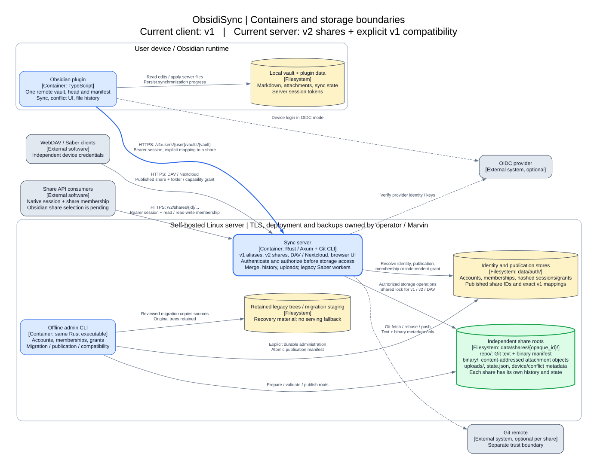
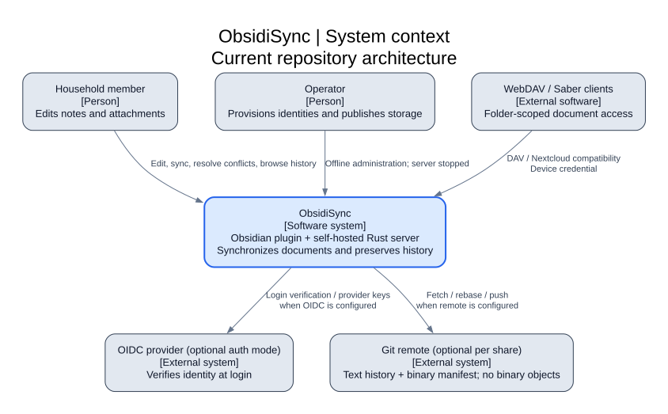

# ObsidiSync architecture

ObsidiSync synchronizes an Obsidian vault with a self-hosted Rust server that maintains Git-backed text history
and a separate attachment object store. The device runs the TypeScript plugin; native Git runs on the server.

This page describes the working tree inspected on 2026-10-09. It describes implemented interfaces, not a verified
production deployment. Start with the container diagram for the main runtime and privacy boundaries, then read
the sync and authorization sections for behavior across those boundaries.

## Containers and storage boundaries



Blue boxes are runnable software, cylinders are persisted data, and dashed relationships are optional integrations.
The server's handlers, merge logic and background workers run in one process, rather than as separate services.
The offline admin CLI is another mode of the same executable. It cannot run alongside the server against the same
data directory: both hold the exclusive lifetime OS lock `data/.obsidisync.lock`.

The key transition is asymmetric: the server implements published shares and `/v2/shares`, while the current
plugin constructs `/v1/users/{user}/vaults/{vault}` URLs. In the production entry point, v1 resolves an explicitly
published mapping to the same share root used by v2. It does not serve the retained legacy tree.

## System context



Household members edit ordinary Markdown and attachments. External WebDAV clients use device credentials rather
than native user sessions. Existing Saber clients use a Nextcloud compatibility surface, with legacy rendering
and background tablet export support inside the server.

OIDC is an alternative authentication mode to the host-local multi-account password store. A Git remote is optional;
without one, history remains in the server's local repository. Neither integration is another application database.
The server sees plaintext documents. Git remotes, backups, server administrators and compromised devices are separate
trust boundaries; share membership provides neither end-to-end encryption nor protection from those actors.

Harmony may consume documents through an explicitly issued service grant. Its household business logic belongs
outside ObsidiSync. Marvin owns provisioning, ingress/TLS, deployment and backups; this repository's Dockerfile
packages the application but does not establish the live host configuration.

## Runtime responsibilities and source map

| Responsibility | Primary implementation |
| --- | --- |
| Plugin commands, settings and UI integration | [src/main.ts](../../src/main.ts), [src/settings.ts](../../src/settings.ts) |
| Client endpoint construction, sessions and sync orchestration | [src/gitService.ts](../../src/gitService.ts) |
| Local file manifest and application of server files | [src/vaultState.ts](../../src/vaultState.ts), [src/serverFiles.ts](../../src/serverFiles.ts) |
| Startup, configuration and offline command dispatch | [main.rs](../../rust-server/src/main.rs) |
| v1, auth, browser and compatibility routing | [http.rs](../../rust-server/src/http.rs) |
| Native share API | [v2.rs](../../rust-server/src/v2.rs) |
| Session authentication and typed principal resolution | [auth.rs](../../rust-server/src/auth.rs), [app_session.rs](../../rust-server/src/app_session.rs) |
| Accounts, share membership and publication authority | [accounts.rs](../../rust-server/src/accounts.rs), [publication.rs](../../rust-server/src/publication.rs) |
| Git-backed sync, history, uploads and storage state | [vault.rs](../../rust-server/src/vault.rs), [git.rs](../../rust-server/src/git.rs) |
| Attachment objects and Git binary manifest | [binary_store.rs](../../rust-server/src/binary_store.rs) |
| DAV mounts, scope checks and Nextcloud compatibility | [webdav.rs](../../rust-server/src/webdav.rs), [nextcloud.rs](../../rust-server/src/nextcloud.rs) |
| Legacy device passwords and independent share grants | [device_passwords.rs](../../rust-server/src/device_passwords.rs), [share_credentials.rs](../../rust-server/src/share_credentials.rs) |
| Offline operations, migration and durable storage | [admin.rs](../../rust-server/src/admin.rs), [migration.rs](../../rust-server/src/migration.rs), [auth_storage.rs](../../rust-server/src/auth_storage.rs) |

## A normal plugin synchronization

The client keeps one configured remote vault, server head and local manifest for each local Obsidian vault.
It checks compatibility and registration, computes changes against its saved manifest, and stages changed content
through bounded uploads. The sync request supplies the base head, client identity, manifest and upload references.

```mermaid
sequenceDiagram
    participant L as Local Obsidian vault
    participant P as Plugin
    participant H as Rust HTTP API
    participant V as Share storage / Git
    P->>H: Compatibility / registration (v1 bearer session)
    H->>H: Authenticate, resolve mapping, check membership and capability
    P->>L: Compare files with saved manifest
    P->>H: Stage uploads (initialize, chunks, complete)
    H->>H: Authorize each request
    H->>V: Verify and retain staged bytes
    P->>H: Sync(baseHead, clientManifest, changes)
    H->>H: Authorize before share storage access
    H->>V: Serialize operation; merge and commit
    Note over H,V: Optional configured remote: fetch / rebase / push
    V-->>H: Head, changed files and conflicts
    H-->>P: Inline content or file references
    opt File reference mode
        P->>H: Download each blob at returned head
        H->>H: Authorize each download
        H-->>P: File bytes
    end
    P->>L: Verify and apply files; persist progress
```

This is a logical flow, not a full retry or Git-operation trace. The server serializes access to a share's storage;
v1 and v2 do not maintain independent writable copies. Text merging uses Git tooling, while binary contents stay
outside Git. With `syncFileReferences`, the client downloads returned file references individually and verifies
checksums, avoiding a single response containing the entire vault. Older protocol peers retain inline content.

Unresolved text conflicts return marker content and remain pending for the originating device. The client keeps
conflicted files visible as unsynchronized changes and offers explicit resolution; other devices can continue.
First sync requires a reconciliation choice. Force push can delete server-only files, and overwrite-local replaces
local contents with an optional local backup. These are explicit recovery decisions, not safe automatic migrations.
See the root [README](../../README.md#first-sync) for the existing user workflow.

V2 additionally supports read-only synchronization. A no-change request reads the published head without upstream
fetch/rebase, commits or device/version bookkeeping. This server capability does not mean that the current plugin
implements read-only share selection or durable client reconciliation.

## Authorization boundaries

A share is both the storage and native authorization boundary. Opaque IDs address shares; labels do not resolve
storage. Each share owns its Git history, attachment objects, uploads, conflicts and device state. Folder scope is
an additional restriction on device grants, not a substitute for native share membership.

Native sessions resolve to typed principals: an immutable local account ID, a verified OIDC issuer/subject pair,
or an explicitly enabled development identity. Local password mode now supports multiple host-provisioned accounts;
public password setup is retired. Development tokens are for local fixtures and do not bypass membership.

V2 checks publication and membership before constructing the share-scoped storage service. Listings include only
accessible published shares. Inaccessible, unpublished and retired shares return `404`; an accessible share with
insufficient capability returns `403`. Authorization covers history, blobs, ranges and metadata as well as sync.
Legacy v1 additionally checks the URL user namespace and the mapping's explicit typed principals. Another member
cannot use someone else's legacy alias merely because they share the same destination share.

Activated share device credentials are independent grants with a fixed share, folder and capability. Removing their
creator's membership or disabling the account does not revoke them. Revocation is explicit; share retirement makes
the associated grants unavailable. DAV rejects traversal, symlinks and cross-share operations. New share credentials
do not enable Saber; legacy DAV/Saber credentials retain their reviewed original mapping and settings.

Native session revocation and independent device-grant revocation have different lifecycles. Disabling a local
account blocks login/refresh, but existing access tokens may remain valid until expiration. Current membership
checks still apply to native share access. Previously synchronized local copies cannot be securely erased remotely.
The [storage and migration runbook](../SHARE_STORAGE_AND_MIGRATION.md) gives the precise compatibility and grant rules.

## Persistent data and recovery

```text
data/
  .obsidisync.lock                 Lifetime server/admin exclusion
  auth/                           Accounts, memberships, sessions and credentials
    share-publication.json        Published roots, v1 mappings and activation authority
    share-migration-pending.json  Present during an unfinished migration; blocks startup
  shares/{opaque_share_id}/
    repo/                         Git text history and .obsidian-git-sync/binary-manifest.json
    binary/                       Attachment objects referenced by Git metadata
    uploads/                      Incomplete and completed unconsumed staged transfers
    state.json                    Registration / remote configuration
    ...                           Per-share device, conflict and other metadata
  users/{user}/vaults/{vault}/     Retained legacy sources after migration; no runtime fallback
  migrations/{set_id}/             Reviewed migration staging / recovery material
```

The production entry point validates publication before starting workers or listening. Missing/corrupt authority,
incomplete published roots and a pending migration fail closed. Test-only constructors can use legacy fixtures;
they do not describe production startup behavior.

Migration is an offline, explicitly reviewed copy-and-publication operation. It retains legacy sources, validates
staged share roots, and commits the reviewed set through a single durable publication-manifest rename. Individual
JSON file writes are not a general multi-file transaction. Upgrade does not automatically publish storage, activate
credentials or reset client state. See the [runbook](../SHARE_STORAGE_AND_MIGRATION.md#reviewed-migration) for backup,
dry-run, apply, interruption and rollback procedures; this overview is not an operator command checklist.

Backups must preserve the complete data directory consistently, including auth/grants, Git, attachment objects and
pending uploads. A Git remote alone cannot restore binary history or credentials. After resumed writes, restoring
an old backup requires reconciliation of newer data. Backups and auth stores contain sensitive material, including
recoverable legacy Saber encryption configuration.

## Implemented versus planned

| Area | Current repository | Planned work |
| --- | --- | --- |
| Server privacy boundary | Published independent shares, typed membership, v2 API | Production migration requires separate operator action |
| Obsidian routing | One v1 user/vault endpoint via explicit compatibility mapping | [FEAT-04 share selection and client migration](../FEAT-04-client-share-selection-and-migration.md) |
| Local vault composition | One remote sync state per local vault | [FEAT-05 composite mounts](../FEAT-05-composite-local-vault-synchronization.md) |
| Device integration | Independent share DAV grants plus retained legacy DAV/Saber | Share-native Saber configuration remains deferred |

The eventual composite vault must keep separate heads, manifests and recovery decisions for each share. That is
future client work; no composite mount or cross-share atomic rename is implied by these diagrams. The
[FEAT-03 audit](../FEAT-03-IMPLEMENTATION-AUDIT.md) records implementation and fixture evidence separately from deployment.

## Reproducing the diagrams

From the repository root in Ubuntu/WSL, run:

```bash
make diagrams
```

This installs the locked documentation-only npm dependency with lifecycle scripts disabled, then renders both SVGs
locally using Graphviz WebAssembly. It needs Make, Node.js and npm; first-time dependency installation needs registry
access. Diagram contents are not sent to a rendering service. The application dependency manifests are unchanged.

The C4-style context and container sources are [context.dot](diagrams/context.dot) and
[container.dot](diagrams/container.dot). Graphviz DOT is used instead of PlantUML to avoid requiring Java, native
Graphviz or Docker in the established environment. Edit sources and rerun the target; never edit SVGs by hand.
The behavioral sequence uses Mermaid directly in Markdown. The root Makefile also wraps the existing `npm run build`
and `npm test` commands without changing their scope.
